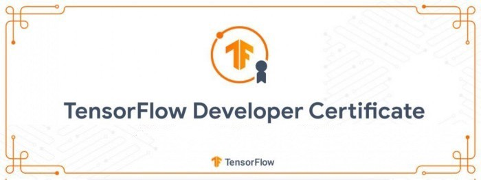

# Tensorflow-Certification

Preparation for Tensorflow Certification

Includes word documents to explain notebooks 

Backbone.py contains useful code snippets for the exam ʕ•́ᴥ•̀ʔっ♡

Includes:

- Image Classification
  - Data Augmentation
  - Training Callbacks
  - Transfer Learning
- Natural Language Processing
  - Data preprocessing (Tokenization, ngrams, padding)
  - Embeddings
  - Transfer Learning
  - Text Generation with Bidirectional LSTMs
- Tensorflow 2.x Basics
  - Plotting accuracy curve
  - Tensorflow Datasets API
- Time Series
  - Data preprocessing with Tensorflow Datasets API
  - Timeseries prediction with LSTMs
